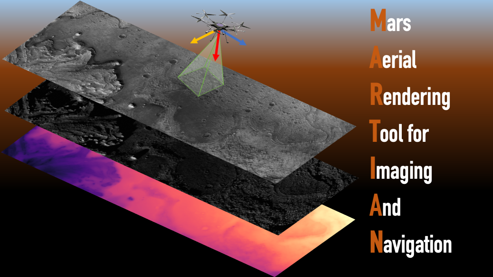
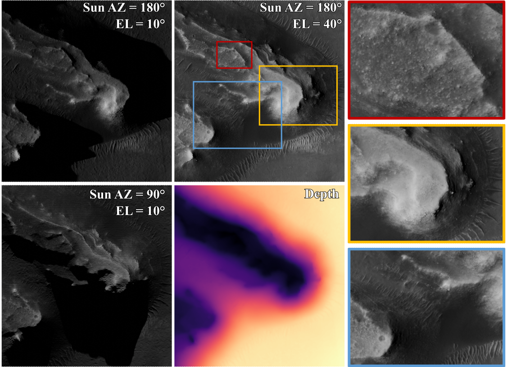

## MARTIAN 

#### Authors: Dario Pisanti, Georgios Georgakis



The Mars Aerial Rendering Tool for Imaging And Navigation (MARTIAN) is a python-based software integrated in Blender 4.0, which imports [HiRISE](https://www.uahirise.org/) Digital Terrain Models (DTMs) and ortho-projected images to simulate maps and aerial observations of the sourced Martian site  under user-defined lighting conditions, and camera intrinsic and extrinsic parameters. The framework operates with two modes: "demo" and "dataset". The former produces perspective and orthographic observations along with depth information at desired locations of the terrain mesh. The latter allows to generate maps and observations image datasets, with camera locations sampled over specified areas of the Martian site with desired altitude and attitude ranges, and Sun azimuth and elevation angles. The tool is presented in Pisanti, D., Hewitt, R., Brockers, R., & Georgakis, G.,  "Vision-based Geo-Localization of Future Mars Rotorcraft in Challenging Illumination Conditions" ([pdf](https://arxiv.org/abs/2502.09795)), where it has been used to generate datasets including maps and aerial observations of the [Jezero crater](https://hirise.lpl.arizona.edu/dtm/dtm.php?ID=ESP_046060_1985) to train and test Geo-LoFTR, a novel learning-based image registration method for the Map-based Localization ([MbL](https://github.com/nasa-jpl/mbl_mars)) of the Mars Science Helicopter conceived by NASA Jet Propulsion laboratory.

## Example: ortho-maps and observations under different illumination conditions



<details>
      <summary> [Figure caption] </summary> 
The figure shows orthographic images of a map tile from the Jezero crater site rendered under different combinations of Sun Azimuth (AZ) and Elevation (EL) angles, along with the depth information. Three perspective aerial observations (right column) are sampled from the map tile at different altitudes, under Sun AZ=180° and EL=40°. 
</details>

## Prerequisites

Ensure you have Anaconda or Miniconda installed on your system. You can download and install it from the Anaconda website.

https://www.anaconda.com/docs/getting-started/anaconda/install

<details>
      <summary> [Anaconda (Linux/macOS - recommended)] </summary> 
To install Anaconda on Linux run from terminal:

```
curl -O https://repo.anaconda.com/archive/Anaconda3-2024.10-1-Linux-x86_64.sh
bash ~/Anaconda3-2024.10-1-Linux-x86_64.sh
```

To install Anaconda on macOS with Apple Silicon architecture run:
```
curl -O https://repo.anaconda.com/archive/Anaconda3-2024.10-1-MacOSX-arm64.sh
bash ~/Anaconda3-2024.10-1-MacOSX-arm64.sh
```

or run the following for the Intel architecture:
```
curl -O https://repo.anaconda.com/archive/Anaconda3-2024.10-1-MacOSX-x86_64.sh
bash ~/Anaconda3-2024.10-1-MacOSX-x86_64.sh
```

Close and re-open your terminal window for the installation to fully take effect.
</details>
<details>
      <summary> [Miniconda (Linux)] </summary> 

These four commands quickly and quietly install the latest 64-bit version of the installer and then clean up after themselves. To install a different version or architecture of Miniconda for Linux, change the name of the .sh installer in the wget command. 

```
mkdir -p ~/miniconda3
wget https://repo.anaconda.com/miniconda/Miniconda3-latest-Linux-x86_64.sh -O ~/miniconda3/miniconda.sh
bash ~/miniconda3/miniconda.sh -b -u -p ~/miniconda3
rm -rf ~/miniconda3/miniconda.sh
```

After installing, initialize your newly-installed Miniconda. The following commands initialize for bash and zsh shells:
```
~/miniconda3/bin/conda init bash
~/miniconda3/bin/conda init zsh
```
</details>

## Setup (Blender 4.0)

<details>
      <summary> [Linux] </summary> 

#### Install Blender and create conda environment
To download and install Blender 4.0 run from the terminal:

```
wget https://download.blender.org/release/Blender4.0/blender-4.0.2-linux-x64.tar.xz
tar -xf blender-4.0.2-linux-x64.tar.xz
```

Deactivate the current python version used by Blender:

```
cd ~/blender-4.0.2-linux-x64/4.0
mv python _python
```

Create and activate a new conda environment with a python version matching the one that Blender comes with (for  Blender 4.0, you need python 3.10):


```
conda create -n martian-env python=3.10
conda activate martian-env
```

If you have installed Anaconda with the default parameters, your conda environment should be installed here:

```
~/anaconda3/envs/martian-env
```

#### Install dependencies
Clone the git repo and install dependencies:
```
git clone https://github.com/nasa-jpl/martian.git
cd ~/martian
conda install --file ./requirements.txt
```

If some packages are not available via conda or there are conflicts, you can alternatively use pip to install them:

```
pip install -r requirements.txt
```

#### Link the conda environment to Blender

Go back to your Blender folder and link the python installation from the environment just created:

```
cd ~/blender-4.0.2-linux-x64/4.0
sudo ln -s ~/anaconda3/envs/martian-env/ python
```

This creates a junction between the python folder in the Blender files and the folder in the Anaconda environments files. From now on, you can install new python packages by runnning:

```
conda activate martian-env
pip (or conda) install [package_name]
```

Finally, you can add Blender to the PATH environment variable by opening the `.bashrc` file:

```
nano ~/.bashrc
```
and add the the Blender path at the end of the file to append the directory containing the Blender executable to your `PATH`:

```
export PATH=$PATH:~/blender-4.0.2-linux-x64
```

Reload the `.bashrc` file for changes to be effective:
```
source ~/.bashrc
```
</details>
<details>
      <summary> [macOS] </summary> 

#### Install Blender and create conda environment
To download and install Blender 4.0 run from the terminal:

```
curl -L https://download.blender.org/release/Blender4.0/blender-4.0.2-macOS.dmg -o blender-4.0.2-macOS.dmg
hdiutil attach blender-4.0.2-macOS.dmg
cp -R /Volumes/Blender/Blender.app /Applications/
hdiutil detach /Volumes/Blender
```

Deactivate the current python version used by Blender:

```
cd /Applications/Blender.app/Contents/Resources/4.0
mv python _python
```

Create and activate a new conda environment with a python version matching the one that Blender comes with (for  Blender 4.0, you need python 3.10):

```
conda create -n martian-env python=3.10
conda activate martian-env
```

If you have installed Anaconda with the default parameters, your conda environment should be installed here:

```
~/opt/anaconda3/envs/martian-env
```

#### Install dependencies
Clone the git repo and install dependencies:
```
git clone https://github.com/nasa-jpl/martian.git
cd ~/martian
conda install --file ./requirements.txt
```

If some packages are not available via conda or there are conflicts, you can alternatively use pip to install them:

```
pip install -r requirements_for_macos.txt
```

#### Link the conda environment to Blender

Go back to your Blender folder and link the python installation from the environment just created:

```
cd ~/Applications/Blender.app/Contents/Resources/4.0
sudo ln -s ~/opt/anaconda3/envs/martian-env/ python
```

This creates a junction between the python folder in the Blender files and the folder in the Anaconda environments files. From now on, you can install new python packages by runnning:

```
conda activate martian-env
pip (or conda) install [package_name]
```

Finally, you can add Blender to the PATH environment variable by running this command:
```
echo 'alias blender="/Applications/Blender.app/Contents/MacOS/Blender"' >> ~/.zshrc
source ~/.zshrc
```
</details>

## Data Dependencies

To run MARTIAN for a specific site on Mars, you need the following HiRISE assets for that site:

- Digital Terrain Model (DTM) in .IMG file format
- High-resolution orthographic map projection (ortho-image) in .JP2 file format serving as terrain texture
- Low-resolution orthographic map projection in .JP2 file format to support location sampling over the map.

Assets for Jezero Crater can be found at:
https://www.uahirise.org/dtm/ESP_045994_1985

The HiRISE products can be donwloaded and placed in `~/martian/hirise_input`, with the path of the individual files specified in the main .yaml configuration file (see next section).

Ortho-image files have poduct ID in the format:
```
 XSP_xxxxxx_xxxx_CCC_S_NN_ORTHO
```
where the following convention applies:
```
XSP_xxxxxx_xxxx = HiRISE source observation ID 
                  (mission phase_orbit number_target code)

CCC = color content:
      RED = visible RED, 1 band image
      IRB = 3 band enhanced color (IR, RED, BG)

S = scale (e.g. resolution per pixel):
            A = 0.25 m
            B = 0.5 m
            C = 1.0 m
            D = 2.0 m
            etc.

NN = a sequence number to distinguish between orthorectified 
     images from the same HiRISE observation that may be 
    created from different DTMs.

ORTHO indicates that the image has been orthorectified.
```

Further info on HiRISE file naming conventions:
https://www.uahirise.org/PDS/EXTRAS/DTM/ESP/ORB_045900_045999/ESP_045994_1985_ESP_046060_1985/README.TXT

Useful information about the HiRISE observation for the selected site, including solar azimuth and elevation, can be found in the .LBL file in the full directory listing for the related HiRSIE site. For the Jezero crater, this is located at https://www.uahirise.org/PDS/DTM/ESP/ORB_045900_045999/ESP_045994_1985_ESP_046060_1985/

## Configuration files

MARTIAN takes configuration files for the selected Martian site and cameras in .yaml format as input.

<details>
      <summary>[Main .yaml configuration file]</summary>

For the [Jezero crater](https://www.uahirise.org/dtm/ESP_045994_1985) site, a default jezero.yaml file is located at:

```
./configs
```

It includes options for terrain, light source, environment modeling as well as ortho-camera location and rendering engine options.

- **Terrain**: includes the paths of the DTM, the high-resolution ortho-image to use as texture and the low-resolution ortho-image to support queries sampling are specified. They also allow to set the material roughness in the Principled BDSF of the terrain mesh.
- **Light source**: options for the initialization of Sun light source object used in Blender. 
- **Rendering and environment**: options for the Cycles renfering engine and world configuration
- **Ortho-camera location**: initializes the location of the camera rendering ortho-projected images in the Blender world frame.

Any HiRISE observed site with available DTM and ortho-images can be imported in MARTIAN, by including a dedicated .yaml configuration file in `./configs`. Further .yaml files for the [North Arabia](https://www.uahirise.org/dtm/ESP_062519_2210) and [Oxia Colles](https://www.uahirise.org/dtm/ESP_064604_1985) sites are provided as examples.

</details>
<details>
      <summary>[Cameras configuration files]</summary>
Default camera configuration files for ortho- and perspective cameras are located at:

```
./configs/base_cam/ortho_cam.yaml
./configs/base_cam/persp_cam.yaml
```

These options allow to specify Blender camera objects properties according to the camera type, and also image properties for the rendering.
</details>

## Get started

MARTIAN can run in `demo`or `dataset`modes to render specific perspective and orthographic views at user-defined locations in the selected Martian site, or generate large datasets of maps and aerial observations sampled from specified areas on the terrain, respectively. It is also possible to generate .blend files including terrain mesh and textures, which can be imported as standalone files while running on `demo`or `dataset` modes. 

#### Reference frames
The Blender reference frame is assumed as world frame 𝑊 and is defined as a right-handed Cartesian coordinate system, with the X-axis pointing eastward, the Z-axis pointing to the up-direction and the Y-axis completing the orthogonal set. The camera object frame, 𝑂, is defined in Blender as centered in the camera and with its x, y and z axes initially aligned with 𝑊. Each camera location is specified in 𝑊 in terms of the xy-coordinates (m) of the camera center and its altitude (m) above the terrain at the (x, y) location. The orientation of the camera object frame 𝑂 is specified by assigning the Euler angles yaw (&gamma;),pitch (&beta;) and roll (&phi;) in degrees, following a 312 rotation sequence. Specifically, (&gamma;) represents rotation around the Z-axis, (&beta;) is the rotation around the X-axis, and (&phi;) is the rotation around the Y-axis. In Blender, the camera viewing direction is along -Z (down) of the frame 𝑂.

#### Lighting
Both maps and observations are rendered at the same lighting conditions by specifying the Sun orientation. The Sun orientation simulates the scene time of the day and it is assigned by the user in terms of Elevation (EL), defined as the angle between the Sun and the xy-plane in the Blender frame, and Azimuth (AZ), which is the counterclockwise angle between the sub-solar point on the xy-plane and the x-axis. In the Blender reference frame, the Sun’s orientation is represented by Euler angles in a 321 rotation sequence, where the rotation around the z-axis corresponds to AZ, and the rotation around the y-axis is equal to 90° -EL. AZ and EL are given as input in degree.


### Generate a .blend file with DTM and textures

MARTIAN allows to generate a standalone .blend file with terrain mesh, material and applied textures at a desired fraction of the original HiRISE DTM resolution. 

To generate a .blend file from the jezero.yaml configuration file and with a mesh resolution equal to 20% of the original DTM resolution, and with specified file name and destination, run from root:

```
blender --background --python generate_blend_file.py -- --main_yaml jezero.yaml --dtm_resolution 20. --blend_dest hirise_input/jezero_crater/blend_files --blend_filename "jezero_100DTMres_A-ortho_roughness0.9"
```

*Note*:
the .blend file generation does not work when you run it from high-performance computing clusters (e.g. Gattaca2, TACC)

### Run the `demo` mode


The `demo` mode in MARTIAN renders an ortho-projected map with desired pixel resolution and two queries observations with specified camera poses and lighting conditions. The output are gray scale and depth images. The demo allows to visualize a subset of map-to-query pixel correspondences. In case the areas of the rendered images taken by the perspective cameras overlap, the query-to-query correspondences are also plotted.

To launch a demo by generating a terrain mesh from the jezero.yaml file at 100% of the original DTM resolution, and with map rendered at 40° of Sun Elevation and 180° of Sun Azimuth at 0.25 m / pixel, run from root:
```
blender --background --python main.py -- --mode demo --main_yaml jezero.yaml --generate_blend_file --dtm_resolution 100 --demo_name "demo" --dest_dir "./demos" --map_px_res 0.25 --map_dir "./demos/maps --sun_az 180 --sun_el 40 --cam0_altitude 64 --cam0_loc_x " -553.76" --cam0_loc_y 3316.22 --cam0_yaw 0. --cam0_pitch 0. --cam0_roll 0. --cam1_altitude 200. --cam1_loc_x " -548.51" --cam1_loc_y 3033.95 --cam1_yaw 225. --cam1_pitch 10.--cam1_roll 5.
```

For this run the first perspective camera is located at 64 m altitude over the location (x,y) = (-553.76, 33316.22) m, in the Blender world frame 𝑊, with 0° attitude (nadir-pointing camera). The second perspective camera is locat at 200 m altitude over (x,y)=(-548.51, 3033.95) m, with yaw &gamma;=225°, pitch &beta;=10° and roll &phi;=5°. Negative input coordinates for the camera location must be provided in the string format " -X", with X being the real absolute value of the coordinate.

In this example run, the generated blender terrain is not saved. To enable the saving add the arguments:
```
--save_blend (enables the saving of a .blend file)
--blend_dest (desitnation folder of the .blend file)
--blend_filename (.blend file name)
--save_blend (if provided, it saves also the scene set with camera and ligthing)
```
*Note*: the saving option does not work on clusters (e.g. Gattaca2, TACC)

In case a .blend is already available it can be loaded directly by replacing `--generate_blend_file` and `--dtm_resolution` with:

```
--blend_file $file_path_of_the_.blend_file
```

### Generate an image dataset with the `dataset` mode

The MARTIAN `dataset` mode can generate synthetic datasets made of gray scale and depth images of ortho-projected maps and aerial observations at multiple combinations of lighting conditions, with query camera locations sampled from the terrain mesh. Query observations and maps can be rendered seperately.

#### Example run for map renderings
To render multiple maps from the Jezero Crater at 0.25 m/pixel resolution with Sun Elevation varying in the range [10°, 60°] with 10° increment, and Sun Azimuth varying in the range [0°, 315°] with 45° increment, run from root:


```
blender --background --python main.py -- --mode dataset --main_yaml jezero.yaml --generate_blend_file --dtm_resolution 100 --sun_EL_range 10 60 --sun_EL_step 10 --sun_AZ_range 0 315 --sun_AZ_step 45  --render_map --map_dest $DATA_DIR --map_px_res 0.25 --tiles_x 8 --tiles_y 16
```

For computational efficiency in both rendering and map data loading, the maps rendered in tiles along the X- and Y-directions in the image frame (with X along the image width, and Y along the height). Same applies for depth images rendering.   

*Note*: if running on clusters, render one Sun Elevation angle at time. For instance, to render maps with varying azimuth at EL=10°, run:

```
blender --background --python main.py -- --mode dataset --main_yaml jezero.yaml --generate_blend_file --dtm_resolution 100 --sun_EL_range 10 10 --sun_AZ_range 0 315 --sun_AZ_step 45  --render_map --map_dest $DATA_DIR --map_px_res 0.25 --tiles_x 8 --tiles_y 16
```

#### Example run for queries renderings

MARTIAN allows to generate a specified number of query observations randomly sampled over the whole DTM within specified range of altitude, and yaw, pitch and roll angles. To render 500 nadir-pointing observations from the entire Jezero Crater map in the altitude range [64, 200] m, with Sun EL=40° and AZ=180° run, and store them at the location $DATA_DIR, run from root:

```
blender --background --python main.py -- --mode dataset --main_yaml jezero.yaml --generate_blend_file --dtm_resolution 100 --sun_EL_range 40 40 --sun_AZ_range 180 180 --render_queries --query_dest $DATA_DIR --samples 500 --altitude_range 64 200
```

To generate observations with viewpoint offset from nadir-pointing, provide the maximum values of yaw, pitch and roll. For examples, observation with yaw angle in the range [-180°, 180°], pitch in the range [-20°, 20°] and roll in the range [-5°, 5°], add the following arguments:
```
--max_yaw 180.
--max_pitch 20.
--max_roll 5.
```

In MARTIAN is also possible to define a search area on the map to sample the observations from. The search area is specified in terms of x- and y- coordinates range in the Blender world frame. To generate synthetic Ingenuity observations, for instance, you can run:
```
blender --background --python main.py -- --mode dataset --main_yaml jezero.yaml --generate_blend_file --dtm_resolution 100 --sun_EL_range 40 40 --sun_AZ_range 180 180 --render_queries --query_dest $DATA_DIR --samples 500 --altitude_range 10 24 --sample_area --xrange " -2500." 500. --yrange 1000. 6000.
```
where `--sample_area` enables the identification of a search area with specified x-coord. range `--xrange` and y-coord. range `--yrange`.

*Note*: if runnning on clusters, manually specify `--xrange` and `--yrange` in `main.py`, and run just:
```
blender --background --python main.py -- --mode dataset --main_yaml jezero.yaml --generate_blend_file --dtm_resolution 100 --sun_EL_range 40 40 --sun_AZ_range 180 180 --render_queries --query_dest $DATA_DIR --samples 500 --altitude_range 10 24 --sample_area
```


## Citation
If you find our work useful in your research, please use the following BibTeX entry:
```
@article{pisanti2025vision,
  title={Vision-based Geo-Localization of Future Mars Rotorcraft in Challenging Illumination Conditions},
  author={Pisanti, Dario and Hewitt, Robert and Brockers, Roland and Georgakis, Georgios},
  journal={arXiv preprint arXiv:2502.09795},
  year={2025}
}
```

## Copyright
```
Copyright 2025, by the California Institute of Technology. ALL RIGHTS RESERVED. 
United States Government Sponsorship acknowledged. 
Any commercial use must be negotiated with the Office of Technology Transfer at the California Institute of Technology.
 
This software may be subject to U.S. export control laws. 
By accepting this software, the user agrees to comply with all 
applicable U.S. export laws and regulations. 
User has the responsibility to obtain export licenses, or other 
export authority as may be required before exporting such information 
to foreign countries or providing access to foreign persons.
```